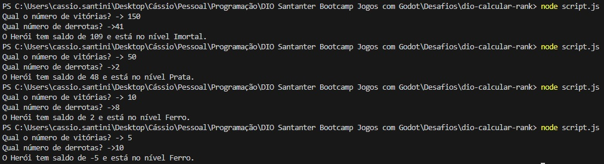

# Desafio - Calculadora de Partidas Rankeadas
Desafio de projeto do Santander Bootcamp DIO Jogos com Godot para criar uma calculadora de partidas rankeadas.

##  2️⃣ Calculadora de partidas Rankeadas
**O Que deve ser utilizado**

- Variáveis
- Operadores
- Laços de repetição
- Estruturas de decisões
- Funções

**Objetivo:**

Crie uma função que recebe como parâmetro a quantidade de vitórias e derrotas de um jogador,
depois disso retorne o resultado para uma variável, o saldo de Rankeadas deve ser feito através do calculo (vitórias - derrotas)

Se vitórias for menor do que 10 = Ferro
Se vitórias for entre 11 e 20 = Bronze
Se vitórias for entre 21 e 50 = Prata
Se vitórias for entre 51 e 80 = Ouro
Se vitórias for entre 81 e 90 = Diamante
Se vitórias for entre 91 e 100= Lendário
Se vitórias for maior ou igual a 101 = Imortal

**Saída**

Ao final deve se exibir uma mensagem:
"O Herói tem de saldo de **{saldoVitorias}** está no nível de **{nivel}**"

## Para rodar o projeto
1. Com o Node Instalado, faça o clone do repositório com o comando `git clone https://github.com/Enyus/dio-calcular-rank.git`
2. Entre na pasta do repo com o comando `cd dio-calcular-rank`
3. Rode o comando `node script.js`
4. No próprio console de comandos, o programa deve perguntar o número de Vitórias e de Derrotas, recebendo um retorno parecido com:

## Observações
Para deixar o projeto mais interativo, usei a biblioteca nativa do Node chamada Readline, que permite que o usuário passe dados para o sistema diretamente no console. [Veja o Link](https://nodejs.org/api/readline.html).
